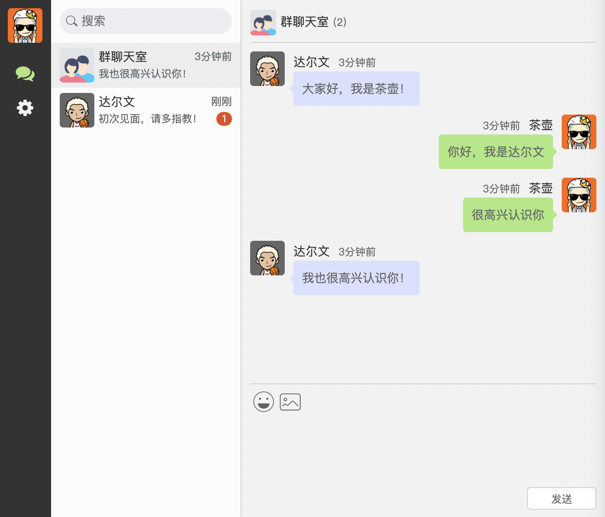
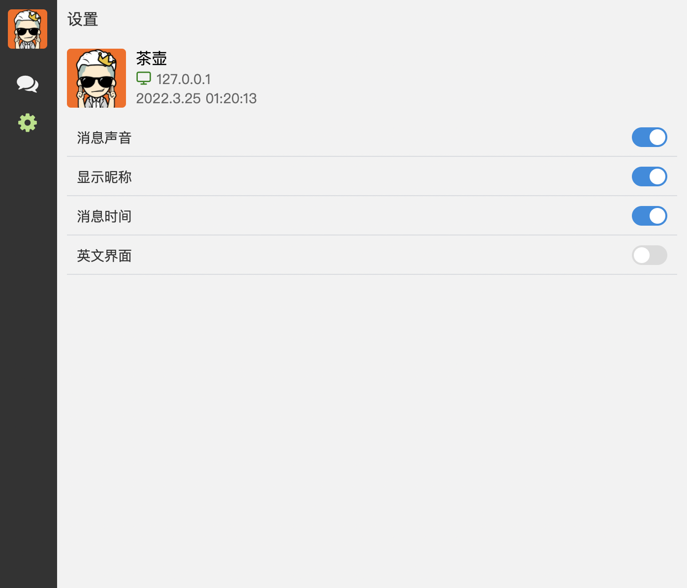
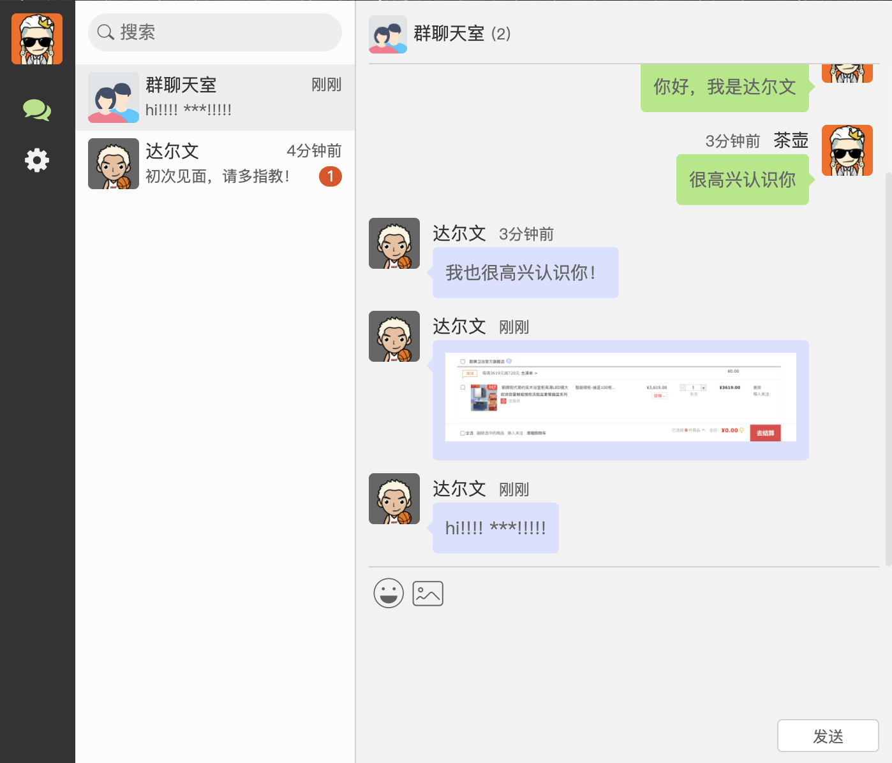
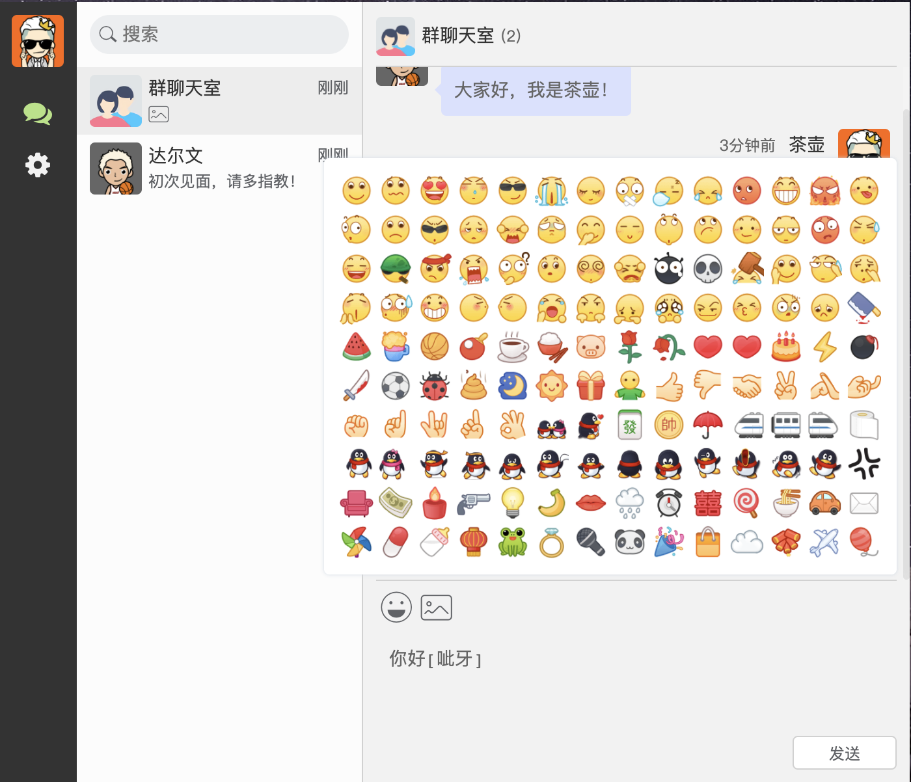
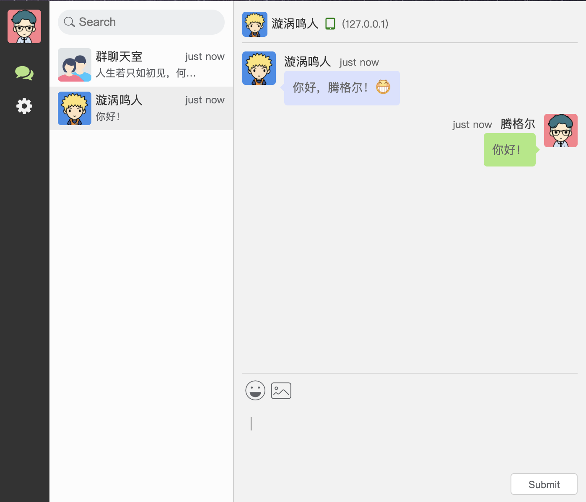
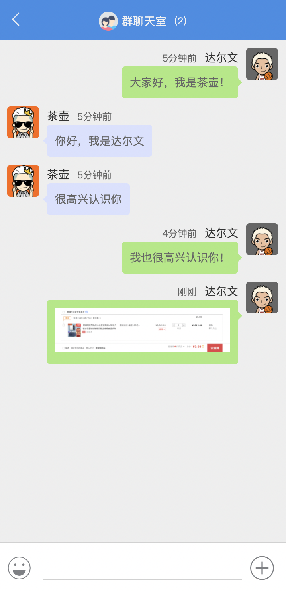
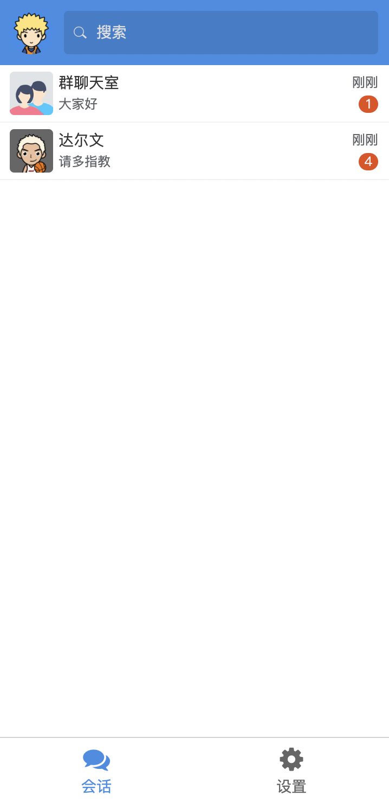
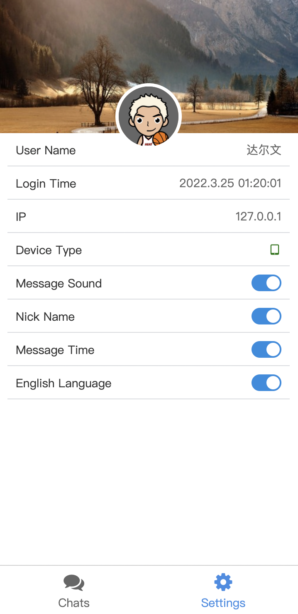

# WebChat聊天室

## 概述

WebChat聊天室是一个基于 `NodeJS` + `Express` + `socket.io` 模块构建的网页聊天室工具。前端使用 `Vue2` 作为前端框架。服务端使用`Express` 搭建 web 服务，使用 `socket.io` 来创建服务端 socket 服务，实现了一些基本的聊天功能。

## 功能介绍

- [x] **新增：支持多国语言（目前仅设置中英文）**

- [x] **新增：服务端默认执行脏词过滤**

- [x] 支持表情发送

- [x] 支持键盘回车发送信息

- [x] 支持在线用户统计和用户列表

- [x] 支持在线用户搜索

- [x] 支持在线用户的私聊

- [x] 支持消息声音提示

- [x] 支持消息显示设置

- [x] 未读消息条数显示

- [x] 支持发送小于1M的图片

- [x] 支持移动端

## 开发步骤
```bash
# 安装依赖
yarn

# 运行客户端
yarn serve

# 运行服务端
yarn prod

# 浏览器访问：http://localhost:8080
```

## 第三方库

### 服务端

- express
快速搭建 Web 服务器。
- socket.io
服务端 socket.io 库
- jsonwebtoken
JWT令牌

### 客户端

- socket.io-client
客户端 socket.io 库
- vue-i18n
Vue 的国际化插件

## 脏词过滤

简单敏感词过滤器，使用DFA实现。
参考链接：https://github.com/aojiaotage/text-censor

## 项目预览















